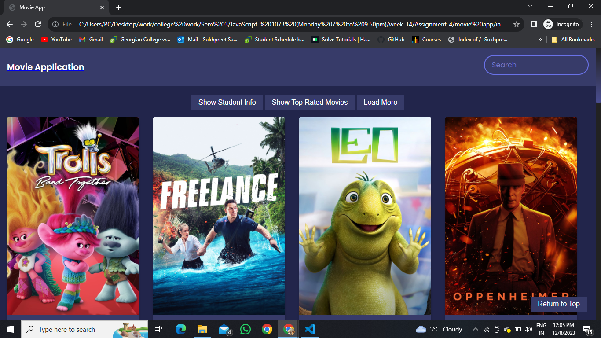
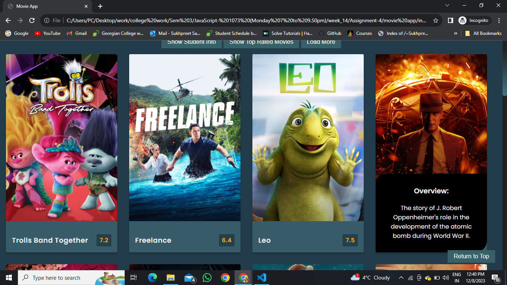
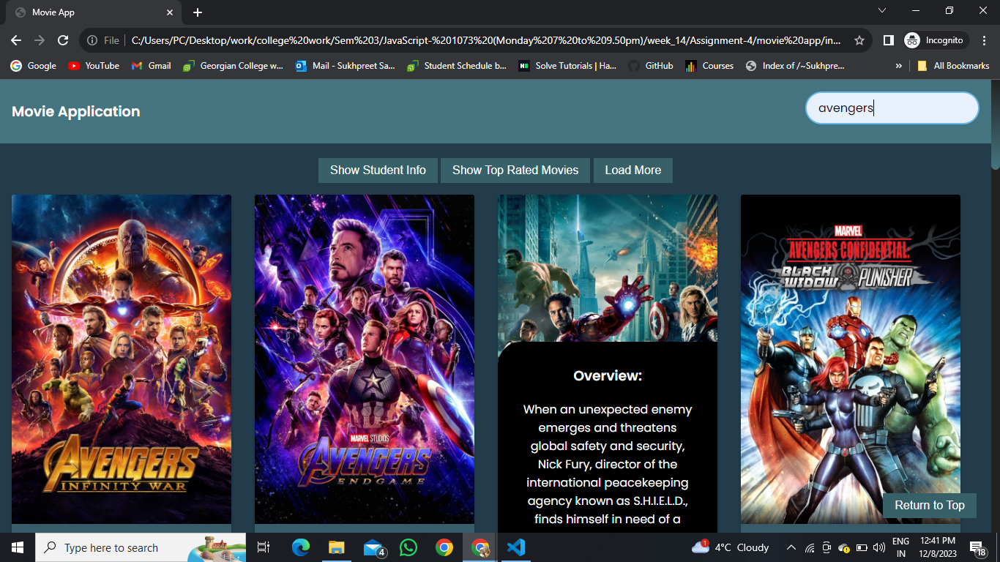

# Movie Magic Unleashed 🎬✨

Dive into the enchanting world of the Movie Application project! 🍿🎉 This dynamic web application invites you to discover and explore movies, search for your favorite titles, and indulge in the excitement of top-rated films. Powering this cinematic journey is The Movie Database (TMDb) API, ensuring you have a blockbuster experience right at your fingertips.

## Features That Steal the Show 🌟

- **Show Student Info**: Unveil the backstage details by clicking the button to display student information (Student ID and Name).
- **Show Top Rated Movies**: Embark on a cinematic adventure with a curated list of top-rated movies fetched from the magical realms of TMDb API.
- **Load More**: Extend your viewing pleasure by loading additional movie results – because who can get enough of captivating stories?
- **Search Movies**: Take the spotlight! Use the search bar to find specific movies and let the app bring your silver screen dreams to life.
- **Return to Top**: Elevate your experience effortlessly by returning to the top of the page with the dedicated button.

## The Opening Scene 🚀

To embark on this epic Movie App journey:

1. **Clone the Repository**: Bring the magic to your local machine with a simple clone:

    ```bash
    git clone https://github.com/SUKH2022/movie_application_with_API.git
    ```

2. **Open and Explore**: Unveil the curtain by opening the `index.html` file in your preferred web browser.

3. **Enjoy the Show**: Lights, camera, action! Explore and immerse yourself in the enchantment of the Movie App!

## The Script Behind the Magic 📜

For a deeper understanding of the Movie Database (TMDb) API, consult the [official documentation](https://developer.themoviedb.org/docs).

## Sneak Peek Behind the Scenes 📸

**Screenshot 1**


**Screenshot 2**


**Screenshot 3**


## Technologies Used 🚀

[](https://developer.mozilla.org/en-US/docs/Web/HTML)
[](https://developer.mozilla.org/en-US/docs/Web/CSS)
[](https://developer.mozilla.org/en-US/docs/Web/JavaScript)
